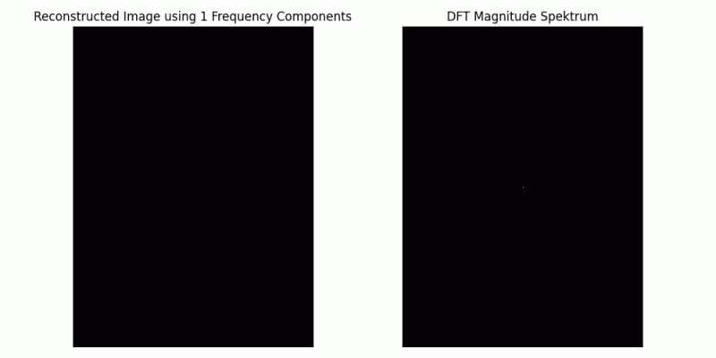

# Learning Image Processing with Python

This repository documents my journey learning image processing through practical implementations in Python. It contains three Jupyter notebooks exploring fundamentals and Fourier transforms.

## Notebooks

### 1. Image Processing Fundamentals
Covers core concepts including:
- Digital image representation
- Color spaces and models 
- Basic transformations and filters
- Histogram operations

### 2. Discrete Fourier Transform Implementation
Custom implementation of DFT based on "Python Programming and Numerical Methods" by Kong, Siauw, and Bayen. Includes:
- Mathematical foundations
- Step-by-step implementation
- Performance analysis
- Comparison with NumPy's FFT

### 3. Spatial Domain vs. Frequency Domain
Explores relationships between spatial and frequency representations through:
- Wave superposition visualization
- Frequency filtering effects
- Practical image manipulation examples

Representation of the image using various numbers of frequency components 
